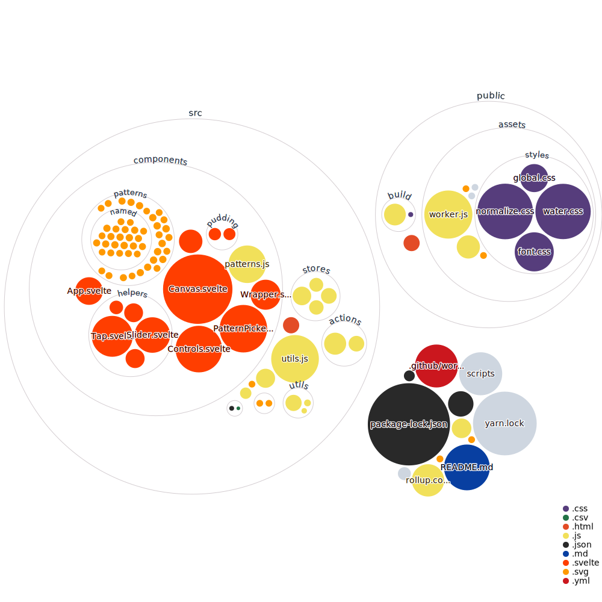

# Svelte Starter 




This [starter template](https://github.com/the-pudding/svelte-starter) aims for fast and easy web development with HMR, and pre-rendered HTML for optimal static hosting.

_Please note: do not use or reproduce The Pudding logos or fonts without written permission._

#### Features

- [HMR](https://github.com/rixo/svelte-hmr) for lightning fast development
- [Feather Icons](https://github.com/feathericons/feather) for simple/easy svg icons
- [ArchieML](http://archieml.org/) for micro-CMS powered by Google Docs and Sheets
- [LayerCake](https://layercake.graphics/) enabled by default for chart
- [Water.css](https://github.com/kognise/water.css) for default styling
- Includes csv, json, and svg imports by default
- Pre-renders HTML on deploy with content that is hydrated on load
- Configured to make easy deploment to Github Pages

## Quickstart

New school: just click the `Use this template` button above.

Old school:

```bash
npx degit the-pudding/svelte-starter my-project
```

Then in your local repo:

```bash
npm install
npm run build
```

## Development

To start the dev server:

```bash
npm run dev
```

Modify content in `src` and `public/assets`.
test

## Deploy

```bash
npm run deploy
```

This generates a directory called `ssr` with the server-side rendered static-hostable app.

If deploying to github pages:

```bash
make github
```

## Style

There are a few stylesheets included by default in `template.html`. Modify `global.css` variables to make changes to `water.css` defaults.

You can use SCSS or another CSS preprocessor by installing the module (eg. `node-sass`) and including the property in the svelte-preprocess in the rollup config files.

## Google Docs and Sheets

- Create a Google Doc or Sheet
- Click `Share` button -> advanced -> Change... -> to "Anyone with this link"
- In the address bar, grab the ID - eg. ...com/document/d/**1IiA5a5iCjbjOYvZVgPcjGzMy5PyfCzpPF-LnQdCdFI0**/edit
- paste in the ID above into `config.json`, and set the filepath to where you want the file saved
- If you want to do a Google Sheet, be sure to include the `gid` value in the url as well

Running `npm run gdoc` at any point (even in new tab while server is running) will fetch the latest from all Docs and Sheets.

## Pre-loaded helpers

### Helper Components

Located in `src/components/helpers`.

- `Window.svelte`: A wrapper around svelte:window that automatically debounces resize and throttles scroll, storing `innerHeight`, `innerWidth`, and `scrollY` as global stores.
- `Icon.svelte`: Simple integration with Feather Icons.
- `Slider.svelte (and Slider.Slide.svelte)`: A slider widget, especially useful for swipe/slide stories.
- `Tap.svelte`: Edge-of-screen tapping library, designed to integrate with slider.

### Pudding Components

Located in `src/components/pudding`.

- `Footer.svelte`: Pudding recirculation and social links.
- `Header.svelte`: Pudding logo.

### Actions

Located in `src/actions`.

- `inView.js`: detect when an element enters or exits the viewport.
- `css.js`: dynmically change the value of a CSS variable.

### Utils

Located in `src/utils/`.

- `mapToArray.js`: Convenience function to convert maps (generated from d3 group and rollup) to iterable array of objects.
- `move.js`: transform translate function shorthand.

### Preset Stores

These are located in `src/stores`, to include them do this (replacing `name`):

```js
import name from "../stores/name.js";
```

- `prefersReducedMotion`: returns a boolean if the user has this CSS media query enabled or not.

- `viewport`: returns an object `{ width, height }` of the viewport dimensions. It is debounced for performance.

- `scrollY`: returns an number window vertical scroll position. It is throttled using rAF for performance.

- `timer`: returns an object { timer, elapsed }. `timer` has 5 methods (start, stop, toggle, set, reset) and `elapsed` is a store that is the number of ms.

### Utils

`transformSvg.js`: this custom transition lets you apply an svg transform property with the in/out svelte transition. Parameters (with defaults):

```js
{
	target: "", // string: transform properties [required]
	delay: 0, // number: ms
	duration: 250, // number: in ms
	easing: linear, // function: svelte easing function
	relative: false, // boolean: adds target onto pre-existing transform
	opacity: false // boolean: to fade in/out as well
}
```

**Usage**

```svelte
<g out:transformSvg={{ target: "translate(50, 50)" }}>
```

## Notes

Any @html tags, e.g., `{@html user}` must be the child of a dom element so they can be properly hydrated.
